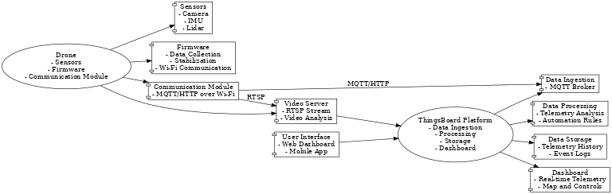
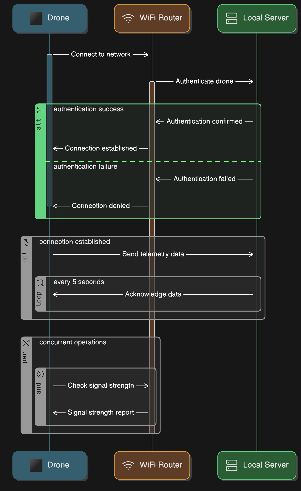

# Описание архитектуры системы "Sentinel Drone"

Проект "Sentinel Drone" включает как аппаратную, так и программную составляющие,
которые обеспечивают выполнение функций дрона для наблюдения, позиционирования и
передачи данных через Wi-Fi. Система состоит из нескольких компонентов, включая
аппаратное обеспечение дрона, серверную часть и программное обеспечение для
управления и обработки данных.

## 1. Аппаратная часть

### Дрон

- **Плата управления полётом (Ardupilot):** Эта плата является центральным
элементом системы управления дронов. Она отвечает за обработку команд по
управлению полётом, стабилизацию дрона и передача данных от сенсоров.
- **Электромоторы и пропеллеры (4 шт.):** Используются для подъема и
маневрирования дронов в воздухе.
- **Камера:** Камера, передающая видеопоток в формате 720p 30fps (h264),
используется для наблюдения и анализа ситуации на объекте.
- **Лазерный дальномер:** Модуль для измерения расстояния до объектов, важен для
точного позиционирования и навигации.
- **Модуль Wi-Fi:** Обеспечивает беспроводную связь с сервером для передачи
данных о положении дрона и видеопотока.
- **Аккумулятор литий-полимерный:** Источник питания для дрона с емкостью от
800 мАч до 2000 мАч, обеспечивающий до 30 минут автономности.
- **Каркас:** Обеспечивает защиту компонентов и жесткость конструкции дрона.

#### Схема подключения

### Серверная часть

- **Сервер/Компьютер:** Основной сервер, подключенный к локальной сети Wi-Fi,
выполняет функции обработки данных и управления дронов. Он получает видеопоток
с камеры и данные с датчиков, а также отправляет управляющие команды обратно на
дрон.
- **ПО сервера:** Программное обеспечение сервера отвечает за получение данных с
дрона, их обработку и анализ, а также за отправку команд для корректировки
позиционирования и других управляющих команд.

## 2. Программная часть

### Прошивка дрона

- **Управление полётом:** На основе Ardupilot, прошивка дрона будет содержать
алгоритмы для стабилизации, маневрирования и управления движением дронов в
трехмерном пространстве. Она также будет обеспечивать контроль за состоянием
сенсоров (камера, дальномер).
- **Передача данных:** Прошивка будет обрабатывать видеопоток с камеры и
передавать его через модуль Wi-Fi на сервер для дальнейшей обработки. Также
будет обеспечена передача данных о положении дронов и сенсорной информации.

### Серверная часть (Программное обеспечение)

- **Обработка видеопотока:** Сервер будет принимать видеопоток, анализировать
его в реальном времени или сохранять для последующего анализа.
- **Обработка данных о положении:** Данные с датчиков (например, лазерный
дальномер) и системы позиционирования будут использоваться для точной настройки
местоположения дронов и корректировки их маршрута.
- **Управление дронами:** Сервер будет отвечать за обработку данных от дронов и
отправку команд обратно для корректировки позиционирования и других параметров
работы.

## 3. Связь и взаимодействие компонентов

- **Wi-Fi сеть:** Все устройства будут подключены к одной локальной Wi-Fi сети
для обеспечения двусторонней связи между дроном и сервером. Это позволит
передавать данные в реальном времени (видеопоток и данные сенсоров), а также
отправлять команды управления обратно на дрон.
- **Протоколы передачи:** Для передачи данных будут использованы стандартные
протоколы для видеопотока (например, RTSP или RTP для передачи видео) и простые
сетевые протоколы для обмена команд и данных о позиционировании (например, HTTP,
MQTT или WebSocket).

## 4. Архитектура взаимодействия

1. **Дрон** собирает данные (видеопоток, данные о положении) и передает их на
сервер через Wi-Fi.
2. **Сервер** получает данные, анализирует их и принимает решения, например, о
корректировке позиции или об изменении направления полета.
3. **Сервер** отправляет команды на дрон для выполнения необходимых действий,
таких как изменения в движении или корректировки угла наклона.
4. Взаимодействие между компонентами осуществляется в реальном времени с
минимальной задержкой для обеспечения точного позиционирования и стабилизации
дронов в условиях закрытых помещений.

### Диаграмма взаимодействия модулей

### Схема работы

